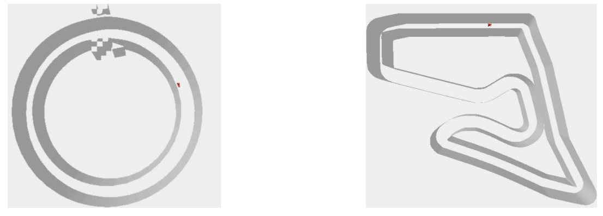

# Reinforcement-Learning
## Final Project : Race Car
### Project Description
The objective of this project is to develop a reinforcement learning agent capable of autonomously controlling a racecar within a vision-based racing environment derived from racecar_gym. The agent receives only a single RGB observation per timestep and must learn to maximize track progress under strict temporal constraints. Performance is evaluated on two tracks—Circle_cw and Austria—each requiring stable, collision-resistant driving behavior under environment randomness. 

**Figure 1.** Maps

### Method
Our approach integrates several reinforcement learning techniques to address partial observability and high-speed control. We employ frame skipping to reduce action variance and frame stacking or recurrent architectures (RNN/LSTM) to provide temporal context. Reward shaping is used to guide policy learning, incorporating progress-based rewards, velocity incentives, and penalties for collisions or unsafe maneuvers. Additional hand-crafted features were explored to simplify representation learning and stabilize training.  

### Result
The resulting agent demonstrated stable navigation on both evaluation tracks. On Circle_cw, the model reliably completed laps, meeting the required threshold. On Austria, reward shaping and temporal modeling improved policy stability, enabling the agent to clear both designated curves without collision. Overall, the applied techniques produced smoother trajectories and more robust performance, even under injected noise and randomized starting positions during evaluation.